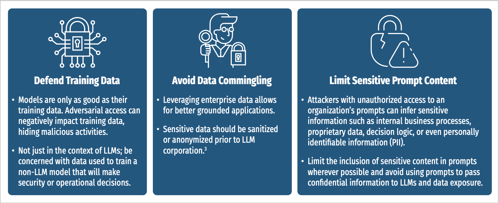
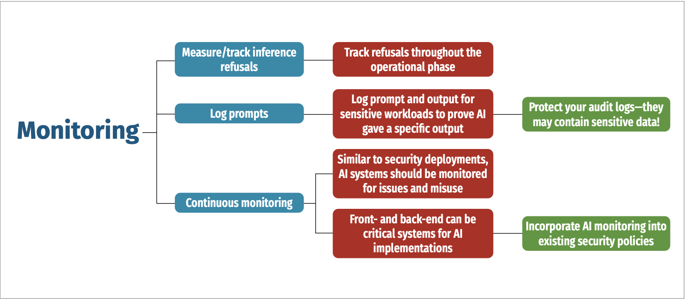

# SANS Critical AI Security Guidelines

v1.1

## Contributing Authors

- Ahmed Abugharbia, Fortinet
- Sarthak Agrawal, U.S. Congress
- Brett Arion, Binary Defense
- Matt Bromiley, Prophet Security
- Chris Cochran, Commandant AI
- Ron F. Del Rosario, SAP
- Mick Douglas, InfoSec Innovations
- David Hoelzer, Occulumen
- Ken Huang, DistributedApps.ai
- Bhavin P. Kapadia, Stablecoins
- Rob Lee, SANS
- Seth Misenar, Context Security Consulting
- Helen Oakley, SAP
- Jorge Orchilles, Verizon
- Jason Ross, OWASP AI
- Rakshith Shetty, Palo Alto Networks
- Jim Simpson, HiddenLayer
- Jochen Staengler, BSI
- Rob Van Der Veer, Software Improvement Group
- Jason Vest, Binary Defense
- Eoin Wickens, Hidden Layer
- Sounil Yu, Knostic

## Overview

As artificial intelligence (AI) continues to revolutionize enterprises and security practices, ensuring security-focused controls for AI implementations is paramount. In this paper, multiple SANS experts and industry professionals delve into the critical categories of Generative AI, encompassing:

- Access Controls
- Data Protection
- Deployment Strategies
- Inference Security
- Monitoring
- Governance, Risk, Compliance (GRC)

Our initial goal was to identify and establish technical security considerations for implementing and utilizing AI within an environment. However, as this space grows, our recommendations have evolved to include governance and compliance frameworks. Topics such as context window management, AI bill-of-materials (AIBOM), and adherence to evolving regulatory standards like the EU AI Act are explored to guide organizations and readers in navigating a complex AI landscape.

From applying least privilege principles to managing vector database access, this paper highlights risks associated with unauthorized interactions and data tampering, and potential data leakage, providing actionable recommendations to mitigate AI-centric concerns and vulnerabilities. Specific emphasis also is placed on guarding against adversarial threats, including model poisoning, prompt injection, and exploitation of public models.

With the rapid advancements in AI, the security landscape is in constant flux. During our editing period, Hangzhou-based DeepSeek released its controversial chatbot application and the U.S.-based Stargate AI infrastructure project emerged. As these events—among many others we will witness—illustrate, securing AI is an ongoing challenge requiring adaptive controls. Thus, this paper captures point-in-time security recommendations.

Thus, this paper captures point-in-time safety and security recommendations. At SANS, we've discovered that many organizations are implementing AI slowly, using risk-based approaches to determine where integrations will be most advantageous. It is in these processes we offer our advice. By considering and/or implementing thease comprehensive measures, enterprises can securely leverage AI capabilities while minimizing risks, ensuring operational efficiency and trustworthiness in an era of increasing reliance on generative and xmachine learning (ML) models.

## Control Categories

As organizations incorporate AI into their operations, they must seek and adopt comprehensive security strategies to mitigate risks. The following sections explore key AI control categories, providing detailed recommendations for secure implementation.

### Access Controls

Effective access controls are fundamental to securing AI modes, their associated infrastructure, and perhaps most paramount - protecting the data. Organizations must implement strong authentication, authorization, and monitoring mechanisms to prevent unauthorized access and model tampering. This section explores best practices for restricting access to AI models, vector databases, and inference processes.

> We've seen AI access controls range from hard-coded privileges to zero trust principles, especially as access extends beyond individual users to connected devices, applications, APIs, and other systems. As you deploy AI capabilities throughout your organization, we recommend utilizing least privilege principles and integrating with your current authentication mechanisms. However, if you plan to move toward stronger access controls, such as zero trust, consider AI in this transition.

### Protect Your Model Parameters

It is critical to ensure traditional security controls, such as principle of least privilege and strong access controls with accountability, have been implemented. Should an unauthorized individual be able to replace or modify a deployed model, untold damage can result. Although this applies to any kind of AI model developed and deployed by an enterprise—including training models, which are highly susceptible to poisoning and attacks—consider the example of a generative agentic system leveraging a large language model (LLM). 

Imagine a bad actor has found an avenue that allows for tampering with the deployed model or the code that drives it. What if the attacker were to tamper with the model or prompt for a model that has the role of an auditor agent? If this auditor agent is relied upon by the rest of the ensemble solution to decide whether responses are appropriate, it may suddenly become possible to cause inappropriate responses to be generated, since the auditor, which acts as a gatekeeper, has been subverted. 

Extending this to other applications, if an AI model is being used to decide whether some activity is malicious or not, allowed or disallowed, and the model can be subverted or replaced, the model is no longer a reliable control. 

In addition to traditional access, protecting model parameters requires applying additional layers of defense. Techniques such as encryption of model files at rest, runtime obfuscation, and the use of Trusted Execution Environments (TEEs) can reduce the risk of unauthorized access or model exfiltration. For further guidance on mitigating runtime model theft, refer to OWASP AI’s resource on [runtime model theft](https://owaspai.org/goto/runtimemodeltheft/).

#### Protecting Augmentation Data

In Retrieval-Augmented Generation (RAG) architectures, vector databases (VectorDBs) are commonly used to store and retrieve semantically indexed data that is felt into LLMs. However, augmentation data used in these systems can be a source of significant risk if not [properly secured](https://cloudsecurityalliance.org/blog/2023/11/22/mitigating-security-risks-in-retrieval-augmented-generation-rag-llm-applications).

Protecting augmentation data requires more than just applying access controls. Data stored in these databases should be treated as sensitive, especially if it influences LLM responses. If tampered with, this data can cause models to generate mislreading or dangerous outputs. 

In addition to enforcing least-privilege access models for both read and write operations, organizaitons should implement secure upload pipelines, logging and auditing of changes, and validation mechanisms to detect unauthorized modifications. Encryption at rest and in transit, along with digital signing of documents or chunks, can enhance trust in the augmentation layer.

### Data Protection

Protecting training data is critical to ensuring AI models maintain integrity and reliability. Without proper safeguards, adversaries can manipulate data and introduce vulnerabilities. Figure 1 outlines the techniques for securing sensitive data, preventing unauthorized modifications, and enforcing strict governance over data usage.

_[Reference from Figure 1](https://epic.org/census-bureau-director-defends-use-of-differential-privacy/)_

### Deployment Strategies

Organizations face critical decisions regarding AI model deployment, including whether to host models locally or use third-party cloud services. Each approach carries security implications that must be carefully evaluated. This section details best practices for securely deploying AI systems and integrating security controls within development environments.

#### Assess Model Hosting Options: Local vs. SaaS Models

There are several models available that can be hosted locally, which is beneficial for use cases where data privacy is critical and sharing with a third party is not desirable. Hosting these LLMs locally ensures greater control over the data, but the trade-off is the need for sufficient processing power to run and manage them effectively. Furthermore, locally hosted models may not have good reasoning performance compared with frontier models. 

Alternatively, if your AI workloads are already operating on a major cloud service provider, it may make sense to run your LLM there as well, using their LLMs hosting services. Because your data is already in the cloud, this option may offer a seamless integration without additional data exposure. 

When weighing where and how to host AI solutions, be sure to think carefully about and codify legal requirements in any contracts. For example, will your data ever be used or retained by the provider for training or refining a model? If the provider claims that they will not store or use your data, what steps have been taken to prevent your data from being logged when sent to and processed by the API endpoint? How are these logs controlled? How long are they stored? Who has access to them?

#### AI Deployment in Integrated Development Environments (IDEs)

IDEs such as VSCode, Windsurf, or Cursor are fully integrated with models or offer LLM integration as a highly desirable option. Although these integrations can significantly increase the efficiency and output of developers, users can inadvertently expose proprietary algorithms, models, API keys, and datasets through AI-powered features. Organizations should explore IDEs with local-only LLM integrations to mitigate risk exposure when local-only LLM integration becomes available. This control ensures that sensitive data remains secure and protected.

#### Implement Access Controls Outside of the Model

By far, LLMs have captured the attention and the imagination of the public and enterprises. Although there are many other types of AI and ML, LLMs seem to represent the technology most actively being pursued by most. 

Many organizations are, rightly, trying to leverage LLMs for knowledge retrieval and customer interaction. The approach some are taking is to fine-tune the model to handle specific types of questions and to introduce additional information into the model. For deployment, a great deal of effort goes into prompt engineering to prevent the model from disclosing information that a particular user might not have the right to access. 

For example, the LLM answers questions for employees and customers. Employees have the right to access more information than customers. Attempting to implement these types of controls within the model is error prone and can often be easily subverted. Instead, consider a RAG-style approach with ACLs applied in the vector retrieval system from which responses are generated. This eliminates the need to attempt to implement these guardrails in the LLM. This approach also has the not-so-subtle benefit of limiting the likelihood of so-called hallucinations in the responses from the LLM. 

In addition, organizations should pay close attention to the use of function calling, especially in agentic AI systems. If not properly scoped, function calls may allow models to invoke external tools or actions beyond their intended purpose. Limit access to critical functions and monitor usage.

#### Be Cautious Using Public Models

Sites such as HuggingFace are wonderful resources for datasets, models, and various tools to facilitate rapid development of AI-based solutions. However, caution is required. Some of the mechanisms used to share models can be leveraged by bad actors to introduce malicious code into the packaging used to deploy the model. In other words, the model itself has not been tampered with, but the package that the model is inside of has been built with malicious actions that will be executed when the [model is unpacked or called](https://blog.trailofbits.com/2024/06/11/exploiting-ml-models-with-pickle-file-attacks-part-1/). 

Models also may be created by bad actors with architectural backdoors in them. The idea of a backdoor like this would be to invoke a specific behavior in response to a specific input. Once a backdoor is created inside of a model, it can be difficult, if not impossible, to remove it via fine turning. This becomes an issue if a user inadvertently triggers the backdoor or, if exposed outside the organization, a bad actor looks for their backdoor [across a swath of models](www.anthropic.com/research/sleeper-agents-training-deceptive-llms-that-persist-through-safety-training).

This becomes even more important to think about as we move toward leveraging AI for the creation of agent-based solutions, especially in the LLM world. Imagine a public LLM that is leveraged to generate code that is used to issue web or other search requests by an agent. Questions include: 

- How much effort would be required to properly sandbox this generated code?
- If you are already building agent-based solutions, have your dev teams thought about this issue? What safeguards have been introduced?
- How have these been demonstrated to be effective? 
 
Remember that developers are often hyper-focused on use cases and are notoriously bad at threat [modeling and abuse cases](https://hiddenlayer.com/innovation-hub/shadowlogic/). Beyond malicious actors creating models with code or backdoors, there is always the risk that models have not been fully tested. Understand that by using public models, you are placing trust in an unknown data scientist to create a model with no flaws and no incorrect or unadvertised behaviors. 
 
Luckily, some testing can be done in house. Manually red team all imported models. Host vetted models in an internal model garden for developers to easily obtain. Red team all solutions that are built, when these models or in-house models are used, specifically attempting to find abuse cases. 
 
For more reference, see [OWASP’s AI Supply Chain guidance](https://owaspai.org/goto/supplychainmanage/), part of their larger AI Exchange.

### Inference Security

AI inference security focuses on protecting models from adversarial manipulation and unauthorized interactions. This section looks at implementation of guardrails, input/ output validation, and anomaly detection to ensure models behave as expected and do not produce harmful or misleading outputs.

#### Establish LLM Guardrails

Guardrails are rules that instruct a model on how to respond or avoid responding to specific topics. These guardrails can be set in various ways. They can be created manually by searching for explicit values in the prompt or response, or they can be built in by the LLM hosting provider. For example, AWS Bedrock allows users to create guardrails, which are essentially rules applied to models. Cloud-hosted AI tools, such as AWS Bedrock, Azure AI, and Vertex AI, also offer cloud-based guardrail applications, which easily integrate with their product offerings. 

Additionally, guardrails can be integrated with other LLMs. In this case, the user’s request and the LLM’s response are passed to another LLM [to detect any “trickery” attempts](www.ml6.eu/blogpost/the-landscape-of-llm-guardrails-intervention-levels-and-techniques). 

Even with these guardrails, recognize that you cannot rely upon them to be infallible. Bad actors are notoriously good at coming up with creative ways to convince an AI model to do things its guardrails specifically prohibit. Ultimately, if there is information or actions that your AI should never disclose or take, the wiser course is to ensure your model does not have access to that information and is not given access that can lead to those actions.

#### Sanitize, Validate, and Filter LLM Inputs/Prompts

Prompt injection represents the most common LLM application attack vector and warrants a multilayered [approach to protection and detection](https://owasp.org/www-project-top-10-for-large-language-model-applications/). All prompts should be preprocessed prior to inference and all model outputs postprocessed prior to response. If employing RAG, additional LLM input filtering and validation would need to occur after the prompt has been augmented.

#### Sanitize, Validate, and Filter LLM Outputs/Responses

Adversaries employ prompt injection to get the LLM application to do or say something it should not. Although trying to prevent or detect the attempted inject should be considered necessary, the complexity and nuance of LLM applications make obvious that merely controlling the input should not be considered sufficient. Additionally, prompt injection primarily focuses on intentional abuse or misuse, yet inputs could still result in undesirable LLM application responses or behaviors. Much as validation and filtering of inputs proves vital, so too is properly handling and assessing outputs. Keep in mind that, like inputs, multiple layers and levels of output might exist in a complex LLM application, such as one that employs web search, function calling, tool use, or downstream LLMs. Output should not be construed to refer only to what would be presented to an end user. 

In multi-user environments or applications where prompts are composed from multiple sources, input segregation is critical. By tagging or isolating user-provided inputs from system- generated context, organizations can reduce the risk of indirect prompt injection.

#### Employ the Principle of Focused Functionality (and Agency)

Models continuously evolve, acquiring tremendous new capabilities and achieving previously unthinkable milestones. Despite this, LLM applications should offer as limited functionality as is acceptable. Since the 1990s, Bruce Schneier has been offering some version of the mantra, “The worst enemy of security is complexity.” In designing agents, it is advisable to explicitly define and limit the functions and tools (code interpreters, web search, and other external APIs) the agent requires access to in order to fulfill its tasks. Avoid assigning multiple tools to an agent and apply the principles of least privilege.

#### Modality

Although amazing, multimodal implementations increase the attack surface. Common sense and research suggest safety and alignment can prove inconsistent across different modalities. As an example, a text-only prompt that might have been considered unsafe could be allowed if the text were instead submitted as an image.

#### Languages and Character Sets

Vast and multilingual training datasets have resulted in models that can natively perform translation, accept input, and provide output across multiple languages and character sets. If needed, this capability can be incredibly useful. However, alignment and safety mechanisms most often have been tailored to the most prominent language expected or heavily represented in the training data. 

It has been shown that multilingual and multicharacter models can introduce new vulnerabilities and expand the attack surface. Multilingual jailbreak challenges have been observed when utilizing prompts in a language [other than the primary training data](https://arxiv.org/abs/2310.06474). Research has shown this can result in jailbreaking or providing instructions to deliberately attack vulnerable LLMs. The same is true for character sets, which have been shown to [increase hallucinations and comprehension errors](https://arxiv.org/abs/2405.14490). Additional research highlights that when instructions involve Unicode characters outside the standard Latin or variants of other languages, a reduction in guardrail efficiency is observed.

#### Encoding/Decoding

Many foundation models, even relatively small ones, often can handle input and output using different encoding schemes. Encoded prompt/response data might be able to bypass security, safety, and alignment measures. Testing by this paper’s authors has shown models often could handle Base64, Hex, or Morse encoded data input without even being explicitly told the formatting or asking for decoding. This even includes smaller and/or open models like GPT-4o mini, Gemini Flash 1.5, Claude 3.5 Haiku, Llama 3.1, DeepSeek v2.5.

#### Compression/Decompression

Another means of input/output obfuscation available to adversaries could include methods of compression and decompression. Support for handling various compression and decompression schemes varies substantially across model implementations.

#### Control and Monitor Access to Interaction/Inference

Depending on the use case and deployment of the LLM application, authentication and access controls should be implemented where appropriate. For public-facing applications, such as help or chatbots to aid or guide website visitors, there is no need to require authentication for user interaction. 

However, internal LLM applications, or those containing sensitive data, should be used with authentication and access controls, with auditing enabled by default in an enterprise environment. The ability to interact with an LLM application and have the model perform inference should be restricted. Unless absolutely necessary, unauthenticated and/or unmonitored access to LLM APIs or frontends should not be allowed.

#### Monitor/Control API Usage

Abuse of LLMs can occur via multiple means. Prompt injection protection and detection methods primarily focus on the content of the input. Content validation, monitoring, and filtering also should be complemented with usage and behavior monitoring focused on the interactions themselves. LLM API keys should be properly managed under robust, secure software development policies, such as no hardcoding of keys in applications.

Observing API usage for misuse is critical. Anomalous spikes in API usage can serve as an effective detection method for abuse, while rate limiting should be considered to restrict the number and cadence of interactions allowed. In addition to rate limiting, organizations also should consider other forms of behavior/anomaly detection. 

Although not limited to interactions through APIs, adversaries can easily automate inputs to exposed API endpoints, making them more susceptible to volumetric attacks. To mitigate this risk, internal training or inference API endpoints, should not be public facing.

### Monitoring

Effective monitoring is essential to maintaining AI security over time. AI models and systems must be continuously observed for performance degradation, adversarial attacks, and unauthorized access. Implementing logging, anomaly detection, and drift monitoring ensures AI applications remain reliable and aligned with intended behaviors. Figure 2 outlines best practices for tracking inference refusals and securing sensitive AI-generated outputs.

### Governance, Risk, Compliance (GRC)

Organizations must align AI initiatives with industry regulations, implement risk- based decision-making processes, and establish frameworks for secure deployment. Additionally, continuous testing and evaluation of AI systems are crucial for maintaining integrity, detecting vulnerabilities, and ensuring compliance with evolving standards. This section explores essential governance structures, regulatory considerations, and best practices for mitigating AI-related risks. 

With the evolving regulatory landscape surrounding AI, organizations must establish governance frameworks that align with industry standards and legal requirements. This section discusses the importance of AI risk management, model registries, AI bill of materials (AIBOMs), and regulatory adherence to ensure ethical and compliant AI usage.

#### Regularly Test and Tune LLM Application/Model

LLM applications and, if possible, the underlying models they employ should be regularly tested to ensure the application’s alignment to confirm it behaves as expected and desired. Though models employed should have been red teamed throughout their development prior to deployment, regular assessments of the deployed models and applications should still be performed. Test results could suggest the need for additional mitigations, tuning, or, if applicable (re)training, to ensure a trustworthy implementation.

#### The Biggest Risk of AI Is Not Using AI

It is unrealistic for a security team today to attempt to tell an organization that AI cannot or must not be used. Not only are virtually any controls that a security team might attempt to implement likely to be trivial to bypass, but it also is growing more and more difficult to find any useful enterprise product that does not leverage AI in some meaningful way.

Security teams need to be mindful that their mission is to facilitate secure operations, not to dictate what workers can or should be doing. It is up to the organization’s leadership to decide what the mission will be and how the organization will achieve that mission. Frankly, if AI is not a significant part of the strategic plan for an enterprise, then some other enterprise in the same space who chooses to leverage AI will likely put you out of business.

To ease stakeholder or GRC concerns, establish an AI GRC board or incorporate AI usage into an existing GRC board. AI usage policies can be developed to guide users to safe and secure platforms, while simultaneously protecting company data. AI functionality within a GRC board should constantly review relevant AI guidance and industry standards, constantly looking for ways to implement approved AI usage. Although leveraging AI can represent risk (as does every other action or inaction on the part of an enterprise), the bigger risk is attempting to insist that “AI will not be used here.”

#### Maintain an AI Bill-Of-Materials

LLM applications depend upon a complex underlying ecosystem for their functionality. Modeled after software bill of materials (SBOM), creation and maintenance of an AIBOM can provide better visibility into relevant aspects of the AI supply chain, including considerations of dataset and model provenance. AIBOMs contain technical details that are useful to adversaries in attacking LLM applications. Care should be taken to limit the disclosure of AIBOMs.

#### Model Registries

Model registries are centralized repositories that track and manage ML models through their life cycle, from development to deployment. These can be a valuable addition to your AI deployment workflows, providing security and governance benefits. Registries track model versions, dependencies, and training data, ensuring full traceability and enabling rollback, if needed.

Benefits also include:
- Access controls to prevent unauthorized modifications or deployments
- Monitoring and drift detection to track performance over time, detecting adversary manipulation
- Reproducibility and consistency, ensuring that models are deployed with correct configurations and
dependencies, preventing unauthorized changes that could introduce vulnerabilities
- Secure storage of model artifacts and associated metadata, preventing unauthorized storage
- CI/CD integration, enabling automated checks and validation during the model deployment process.

#### Account for AI Security and Regulatory Frameworks

Much like the AI landscape itself, the legal and regulatory environment in which AI implementations operate is both complex and rapidly changing. Failure to adhere to legal or regulatory mandates can prove costly. Table 1 lists sample AI security and regulatory Frameworks that organizations may need to comply with, depending on the use of their data. For example, not every organization will need to comply with ELVIS Act, but it lays the foundation for codified prohibitive use of AI.

Though not mandated, tracking to and adherence with other AI/LLM security frameworks or guidance like SANS AI Security Controls, NIST AI Risk Management Framework, MITRE ATLAS,™ or OWASP Top 10 for LLM also can prove beneficial.

**Table 1: Sample AI Security and Regulatory Frameworks**

|Framework Name|Country/Region|Enactment Date|Key Concern(s) Addressed|
|-|-|-|-|
|[Artificial Intelligence Act](https://eur-lex.europa.eu/legal-content/EN/TXT/?uri=CELEX:52021PC0206)|European Union|August 2024|Establishes a risk-based classification system for AI applications|
|[ELVIS Act](https://www.capitol.tn.gov/Bills/113/Bill/SB2096.pdf)|United States|March 2024|Addresses unauthorized use of AI in replicating|voices and likenesses|
|[Executive Order 14110: Safe, Secure, and Trustworthy Development and Use of Artificial Intelligence](https://www.federalregister.gov/documents/2023/11/01/2023-24283/safe-secure-and-trustworthy-development-and-use-of-artificial-intelligence)|United States|October 2023|Defines national policy goals for AI governance and mandates agency actions|
|[Framework Convention on Artificial Intelligence](https://www.coe.int/en/web/artificial-intelligence/the-framework-convention-on-artificial-intelligence)|Council of Europe|September 2024|Emphasizes human rights and democratic values in AI development|
|[Interim Measures for the Management of Generative AI Services (生成式人工智能服务管理暂行办法)](https://www.cac.gov.cn/2023-07/13/c_1690898327029107.htm)|China|August 2023|Ensures generative AI aligns with socialist values and prevents misuse|
|[Israel’s Policy on Artificial Intelligence Regulation and Ethics](https://www.gov.il/BlobFolder/policy/ai_2023/en/Israels%20AI%20Policy%202023.pdf)|Israel|December 2023|Advocates for a sector-based, risk-oriented approach to AI regulation|
|[Safe and Secure Innovation for Frontier Artificial Intelligence Models Act](https://leginfo.legislature.ca.gov/faces/billNavClient.xhtml?bill_id=202320240SB1047)|United States|September 2024|Mandates safety tests for powerful AI models to mitigate catastrophic risks|
|[Utah’s Artificial Intelligence Policy Act](https://le.utah.gov/~2024/bills/static/SB0149.html)|Utah, USA|March 2024|Establishes liability and oversight for generative AI usage|

#### Implement Multilayered Protection/Detection

Although useful, overreliance on system prompts for mitigation of input/output proves suboptimal. The ease with which a system prompt can be updated to better align a model’s behavior is both its strength and its weakness. System prompts should be thought of as a virtual/ temporary/incomplete and tactical mitigation only. Furthermore, system prompts should not be overwritten by user prompts, requiring additional layers of guardrails. Depending upon the scope of the change needed, fine-tuning to better align the model could prove necessary.

#### Secure Agentic Systems and AI Autonomy Controls
The rapid advancement of agent-based architectures (MCP and A2A for example), particularly those leveraging LLMs as autonomous entities, has introduced new dimensions of functionality, and with them, a range of complex risks. Agentic AI systems are now capable of chaining tasks, invoking functions, retrieving information, and acting independently across platforms. These capabilities require security teams to rethink traditional boundaries and controls.
One of the primary concerns with agentic systems is scope creep. Without explicit constraints, agents may invoke unintended tools, access sensitive data, or generate unpredictable behaviors. This could have unintended secondary effects. In response, organizations must enforce focused functionality and apply the principles of least privilege not only to users, but to the agents themselves.
Effective deployment of agentic AI should include:
Defined Function Scope: Agents must be configured with clearly delineated permissions. Limit access to only the tools and data required to complete the agent’s specific task.

Execution Isolation: Use sandboxing or containerization to restrict the operating environment of the agent. This prevents lateral movement and limits potential impact from compromise.

API and Function Call Controls: Gate access to external actions via allowlists and validate agent-initiated requests at runtime. Avoid exposing critical operations without human oversight.

Feedback Loops and Escalation: Agents must include confidence thresholds and fallback mechanisms that escalate uncertain decisions to a human operator.

As agent-based workflows expand, it becomes essential to monitor for autonomy-related anomalies, including excessive tool invocation, task loops, or deviation from expected outputs. Integrating behavioral baselining and anomaly detection will provide needed assurance and containment for autonomous systems in production environments.

#### Incident Response and Forensics for AI Systems
Despite best efforts in security architecture, AI systems, particularly those incorporating public models, RAG pipelines, or complex agent interactions, remain susceptible to compromise. The ability to detect, respond to, and investigate AI-specific threats is critical to maintaining operational resilience and stakeholder trust.
AI-specific incident response (IR) must evolve beyond traditional playbooks. Model poisoning, prompt injection, data leakage through output generation, and unauthorized model extraction represent new categories of security events that require dedicated preparation.
To effectively investigate and contain AI incidents, organizations should:
Capture Audit Trails Across the Stack: Ensure logs include prompt inputs, augmentation sources (like VectorDB queries), model outputs, function calls, and tool invocations.

Monitor for Indicators of Model Tampering: Sudden changes in inference behavior, drift in outputs, or increased refusal rates may indicate adversarial manipulation or unauthorized updates.

Employ Detection on Prompt and Output Layers: Include pattern-based and behavioral monitoring to identify jailbreak attempts, abuse of multilingual prompts, or bypasses via encoding/compression.

Establish a Model Integrity Baseline: Use cryptographic hashes, model registries, and periodic validation checks to confirm deployed models have not been altered.

Playbooks should include specific procedures for model rollback, access revocation, retraining workflows, and data re-validation. Additionally, red teaming and tabletop simulations tailored to LLM misuse scenarios will help test readiness and improve recovery times.

## Conclusion

As AI adoption accelerates, organizations must continue to take proactive approaches to security, ensuring that AI systems are not only effective but also resilient against threats. Implementing robust access controls, data protection measures, and secure deployment strategies is essential to safeguarding AI models from misuse. 

Governance, risk management, and compliance frameworks play a critical role in responsible AI implementations. With continuous testing, monitoring, and adherence to evolving regulatory requirements, organizations can maintain AI reliability and mitigate potential security risks. Furthermore, a multilayered approach to inference security, including strict input validation and output filtering, is necessary to prevent model exploitation. 

AI adoption presents transformative opportunities but also introduces significant security challenges. Organizations that establish strong security foundations and embrace best practices will be well positioned to leverage the transformative potential while minimizing enterprise risk. By prioritizing security and compliance, organizations can ensure their AI- driven innovations remain effective and safe in this complex, ever-evolving landscape.

GLOSSARY OF TERMS
1. Large Language Model (LLM)
A type of generative AI model trained on massive datasets to understand and generate natural language. LLMs are used for chatbots, summarization, translation, and more.
2. Retrieval-Augmented Generation (RAG)
A technique that enhances LLMs by combining them with external vector databases to retrieve relevant context before generation. This improves accuracy but introduces augmentation-related risks.
3. Vector Database (VectorDB)
A specialized database that stores data in high-dimensional vector space, enabling fast semantic search. Often used in RAG to serve context to LLMs.
4. AI Bill of Materials (AIBOM)
A detailed record of datasets, models, code, and dependencies used in an AI system, modeled after software SBOMs, for supply chain visibility and governance.
5. Prompt Injection
An adversarial attack where inputs are crafted to override model instructions or extract confidential information. A leading threat to LLM systems.
6. Inference Guardrails
Policy-enforcing filters applied to model inputs and outputs to prevent harmful, biased, or unauthorized responses during inference.
7. Model Registry
A centralized repository to manage, version, and govern ML models throughout their lifecycle, ensuring reproducibility, rollback, and access control.
8. Multimodal Model
An AI system capable of interpreting and generating multiple data types, text, images, audio, and others increasing utility and complexity of securing interactions.
9. Trusted Execution Environment (TEE)
A secure enclave within a processor that protects sensitive computations and model data from external threats, even on compromised hosts.
10. Drift Monitoring
A process that continuously tracks model performance over time to detect behavioral or data drift, helping prevent unintentional degradation or compromise.
